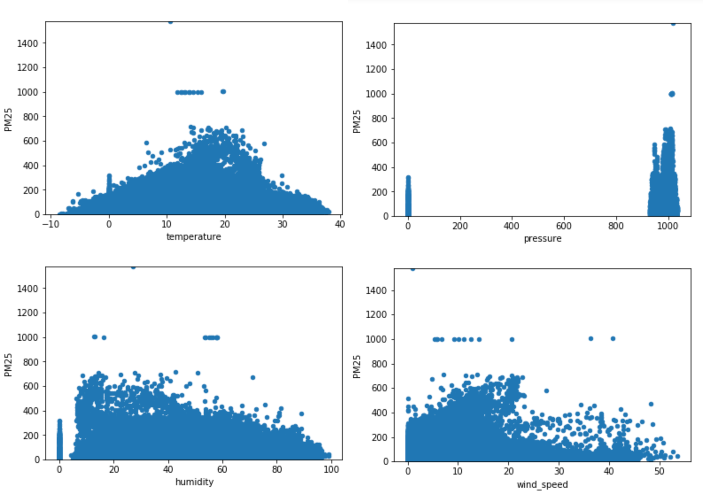

# MS5002 Project Pollutions Prediction

A project in MS 5002 about pollution prediction in Beijing give data by Observed Weather Data and Grid Weather Data. In this project, I use LightGBM to predict the result. The symmetric mean absolute percentage error of 'PM2.5', 'PM10', 'O3' are 0.1718, 0.1579 individually.

Github Link: [https://github.com/WangHaomao/pollution_prediction](https://github.com/WangHaomao/pollution_prediction)

## File Introduction

| FIle name                                                  | Description                                                |
| ---------------------------------------------------------- | ---------------------------------------------------------- |
| dataOverlook.ipynb                                         | Look kinds of details of DataFrame                         |
| dataClean.ipynb                                            | Data clean related                                         |
| dataNANFilling.ipynb                                       | Missing data filling, like mean, mode, same time methods   |
| dataPlot.ipynb                                             | Show pattern of data, like temporary in one year           |
| weather_features_generator.ipynb / generator_helper.ipynb] | Generate weather infortion from near weather/grid stations |
| machine_leanring_model.ipynb                               | Models selection and filling missing data by regression    |
| LightGBM_model.ipynb                                       | Train the LighGBM model                                    |
| Prediction.ipynb                                           | Prediction by LightGBM                                     |
| **Bad Result (useless)**                                   |                                                            |
| seq2seq_model.ipynb                                        | First usage of RNN, the result is not good                 |

## Target

Predicting concentration levels of several pollutants over the coming 24*2 hours (two days) for 35 stations in Beijing, China

|          | Training Set (201701-201801, 201802-201803, 201804) | Test Set(2 days)(20180501-20180502) |
| -------- | --------------------------------------------------- | ----------------------------------- |
| Features | observedWeather                                     | observedWeather                     |
|          | gridWeather                                         | gridWeather                         |
| Labels   | aiqQuality                                          | /                                   |

## Dataset Introduction 
### Stations
3 different categories in Urban Stations, Suburban Stations, and Other Stations.

Each station has longitude and latitude

In **observedWeather** data, station info saved as region/district, e.g. 'zhaitang_meo' they need to find the station name from MAP(station_map)

In **gridWeather** data, station info saved as grad name, e.g. 'beijing_grid_645', they need to change the grid name to longitude and latitude in **Beijing_grid_weather_station.csv** and find the silimar longitude and latitude and get the station name in **Beijing_AirQuality_Stations_en.xlsx**. 

In remain article, the observedWeather data will be used as **ow**, gridWeather will be in **grid**, and AirQuality infor will be in **aq** like **aq_station** , etc.


### Weather and Other Features
All given data are arranged by time, in another word, **time series**. Because of that, instead of using features  to do regression prediction, RNN model like LSTM or seq2seq will be a great choice (it wil be included in next few chapters).

There is a Date / Temperature series image as follow.


### labels

All labels are in aiqQuality_*.csv file, and the goal is to predict three pollutions: **PM2.5**, **PM10**, and **O3** individually.

## Data Cleaning 

### Features generation 
As known in before, the dataset do not provide a directlly weather information in aq_staion, so those weather infor should be generated from ow_station and grid_station.

Here, in each aq_station, for avoiding mistake data, find n (10 in program) **nearest** stations from ow_staions and grid_stations. After remove noiszy data, pick up 3 nearest stations calculate the weighted (by distance) average for current aq_station.

However, data sorting cost lot of time, so I just did above generation method for time in 2018(January to May). For the hole year in 2017, just generate them by the mean instead of weighted mean.

### Filling missing data
**First round** - filling one station by the mean(weighted mean) of other unempty station in one time
**Second round** - filling them by machine learning model (after train the model, by ExtraTreesRegressor )

### Handing outlies

The dataset is quite large, and the data is dirty, it need to be remove outlies. There is the data infor before removing.



After two round handing outliers by manual methon and **IsolationForest**, the result as follow:


## Model Selection

```python
# Example for PM2.5, finally, ExtraTreesRegressor may have a good performace for predicting PM2.5
[-31.02815627 -26.26226587 -27.67365002 -39.12702395]
XGBRegressor: 
Mean Absolute Error 31.022774

[-29.61517035 -21.27699037 -24.04543594 -38.81160377]
ExtraTreesRegressor: 
Mean Absolute Error 28.437300

[-29.99770478 -21.60779073 -24.71741824 -39.44929866]
RandomForestRegressor: 
Mean Absolute Error 28.943053

[-40.79126992 -39.28778516 -40.92853561 -49.47548443]
AdaBoostRegressor: 
Mean Absolute Error 42.620769

[-35.99613709 -29.75958525 -30.80667186 -39.66531717]
LinearRegression: 
Mean Absolute Error 34.056928

[-32.87930483 -29.29948116 -30.56711261 -40.15384476]
MLPRegressor: 
Mean Absolute Error 33.224936
```

```python
# For PM10 and O3, choose below models individually

# PM10
[-27.4800713  -20.78145537 -22.41950421 -33.26037004]
RandomForestRegressor: 
Mean Absolute Error 25.985350

# O3
[-24.78865453 -30.17999697 -29.89527553 -26.47410107]
ExtraTreesRegressor: 
Mean Absolute Error 27.834507
```

Finally the LightGBM performed greater than others, so I decide to use it for the training.


## Model Training

### Data preparing 
The data columns that is ultimately used for training is as follows

```python
# Look at a time series problem
['temperature', 'humidity', 'pressure','wind_speed', 'year', 'month', 'day', 'hour']
```

In order to facilitate validation, I trained the data of 34 stations together and randomly selected one of them to do training validations.

```python
aq_station_name = ['tiantan_aq', 'guanyuan_aq', 'wanshouxigong_aq',
                   'aotizhongxin_aq', 'nongzhanguan_aq', 'wanliu_aq', 'beibuxinqu_aq', 
                   'zhiwuyuan_aq', 'fengtaihuayuan_aq', 'yungang_aq', 'gucheng_aq', 
                   'fangshan_aq', 'daxing_aq', 'yizhuang_aq', 'tongzhou_aq',
                   'shunyi_aq', 'pingchang_aq', 'mentougou_aq', 'pinggu_aq', 
                   'huairou_aq', 'miyun_aq', 'yanqin_aq', 'dingling_aq', 'badaling_aq', 
                   'miyunshuiku_aq', 'donggaocun_aq', 'yongledian_aq', 'yufa_aq', 
                   'liulihe_aq', 'qianmen_aq', 'yongdingmennei_aq', 'xizhimenbei_aq',
                   'nansanhuan_aq', 'dongsihuan_aq']
valid_station = 'dongsi_aq'
```

Details of the model:

```python
# parameters
model_param={'lr': 0.01, 'depth': 10, 'tree': 5000, 'leaf': 400, 'sample': 0.9, 'seed': 3}
params = {
    'task': 'train',
    'boosting_type': 'gbdt',
    'objective': 'regression_l2',
    'metric': {'l2', 'l1'},
    'max_depth': model_param['depth'],
    'num_leaves': model_param['leaf'],
    'min_data_in_leaf': 20,
    'learning_rate': model_param['lr'],
    'feature_fraction': 1,
    'bagging_fraction': model_param['sample'],
    'bagging_freq': 1,
    'bagging_seed': model_param['seed'],
    'verbose': 0
}
```

### Improvement 

Illustrate the distribution before do the log:


Illustrate the distribution after do the log, it looks like near to normal distribution:


### Results of training 

```python
# PM 2.5
Training until validation scores don't improve for 100 rounds.
[100]	valid_0's l2: 0.000527945	valid_0's l1: 0.0160266
[200]	valid_0's l2: 0.000275997	valid_0's l1: 0.0115703
··· # remove 300 - 4999
[5000]	valid_0's l2: 7.53484e-05	valid_0's l1: 0.00478309
Did not meet early stopping. Best iteration is:
[5000]	valid_0's l2: 7.53484e-05	valid_0's l1: 0.00478309
Training until validation scores don't improve for 100 rounds.
# PM 10
[100]	valid_0's l2: 0.00029725	valid_0's l1: 0.0107242
[200]	valid_0's l2: 0.000169163	valid_0's l1: 0.00823492
···
[4900]	valid_0's l2: 5.47693e-05	valid_0's l1: 0.00424848
[5000]	valid_0's l2: 5.46699e-05	valid_0's l1: 0.00424175
Did not meet early stopping. Best iteration is:
[5000]	valid_0's l2: 5.46699e-05	valid_0's l1: 0.00424175
Training until validation scores don't improve for 100 rounds.
# O3
[100]	valid_0's l2: 0.00289016	valid_0's l1: 0.0408911
···
[5000]	valid_0's l2: 0.000694161	valid_0's l1: 0.0162432
Did not meet early stopping. Best iteration is:
[4998]	valid_0's l2: 0.000694161	valid_0's l1: 0.0162431
```


## Reference

[1] https://lightgbm.readthedocs.io/en/latest/